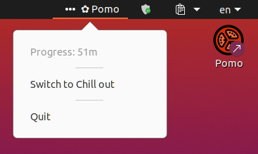

# Pomo

**Pomo** - is tray widget to track and split your work time and to be notified when you should make a break.

# Requirements
- Follow [this](https://github.com/hajimehoshi/oto#prerequisite) link to install deps, required to play sound

# Steps
- go install
- pomo
